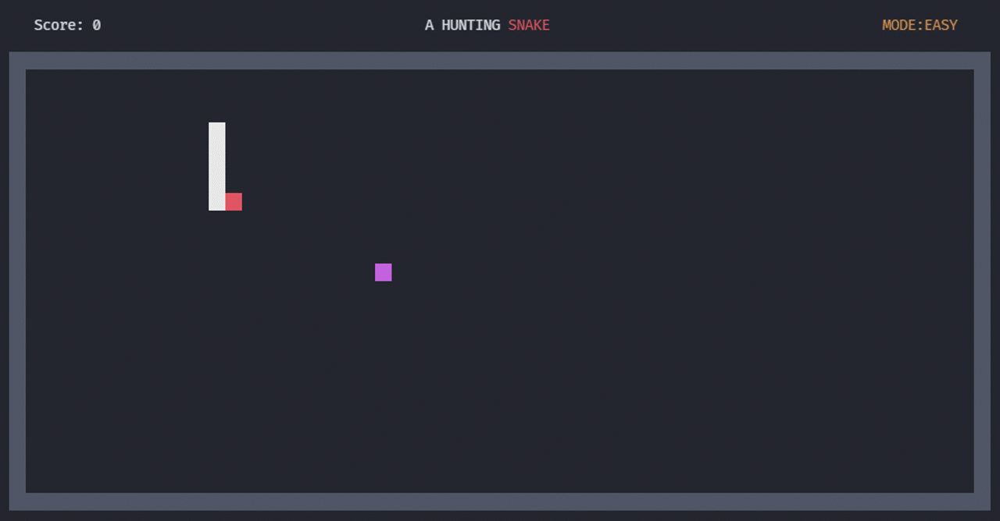
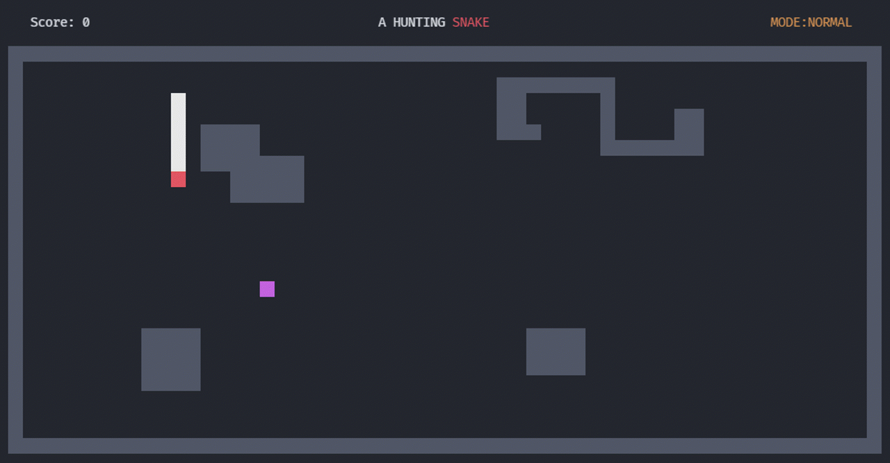
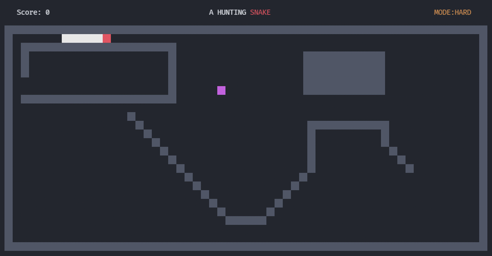
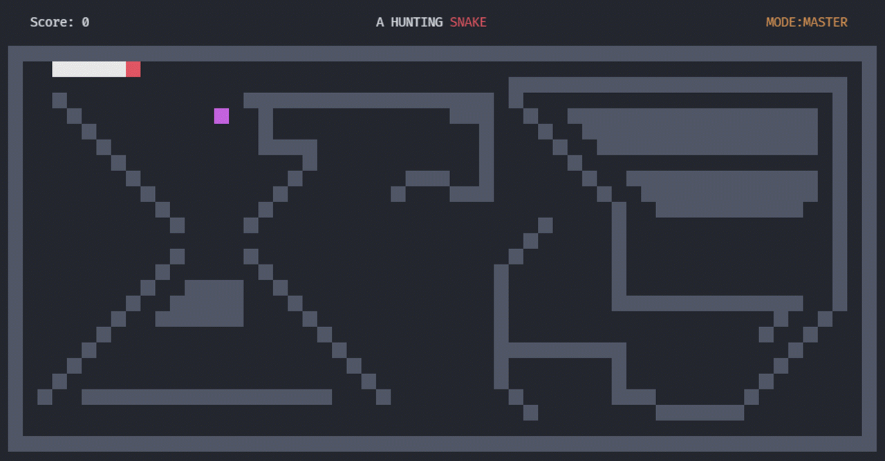

# Coding Game Hunting Snake With Pure C++ Run On Console

## Preview Game Play

    
    

    
    

## To Play Game

+ Open file `gameplay.exe` to play game

## Change Wall Map in game play

+ Go to folder `./graphics`
+ Open any file with mode
+ Change file: `0` is none wall and `1` is have wall

